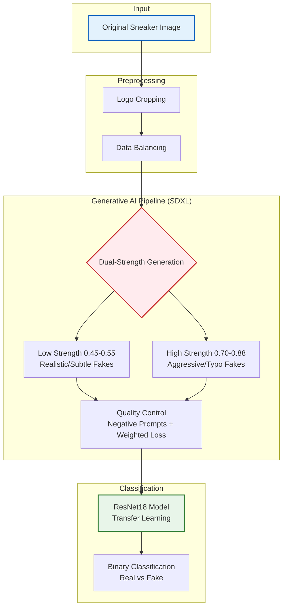

# BrandGuard – GenAI-Based Pipeline for Counterfeit Sneaker Detection 👟🚫

**Automated detection of high-quality and low-quality counterfeit sneaker logos using synthetic data generation and Deep Learning.**

---

## 👥 Team Members
* **Tal Mitzmacher**
* **Amit Mitzmacher**
* **Danny Isserlis**

---

## 1. Project Motivation & Definition 🎯
**The Problem:** The counterfeit market is evolving. Distinguishing between a high-quality fake and an authentic product is becoming increasingly difficult due to a lack of documented fake data.

**Our Goal:** Develop a **Generative Data Pipeline** to create a synthetic dataset of counterfeits and train a classification model (**ResNet18**) to distinguish them with high precision.

**The Innovation:** Instead of relying on scarce real-world fake samples, our system generates variations that alter the logo's semantics (e.g., typos, graphic changes) without compromising its realistic texture.

---

## 2. Visual Abstract (Workflow) 🖼️

The system operates in a closed loop: extracting the authentic logo, generating sophisticated fakes using Stable Diffusion XL (SDXL), and training a classifier on the hybrid dataset.


### Visual Examples
**Workflow Process:** From Original to Cropped to AI-Generated Fake.


**Generated Samples:** A variety of authentic (Green) vs. generated fakes (Red) including typos like "Niky" and low-quality distortions.


---

## 3. Dataset Composition 💾

We combined authentic images with a massive amount of synthetic variations to create a balanced and robust dataset.

* **Total Images:** 4,860
* **Real:** 2,160 (Originals + Augmented Variations)
* **Fake:** 2,700 (Synthetically Generated via SDXL)

### Hierarchical Breakdown
The fake dataset is split to ensure the model learns both basic and advanced forgeries:
* **60% Low-Level Fakes:** Blur, noise, geometric distortions.
* **40% High-Level Fakes:** GenAI-based semantic changes (Typos, wrong logos).


---

## 4. Methodology 🛠️

### A. Synthetic Data Generation (SDXL)
We used **Stable Diffusion XL** with an Image-to-Image pipeline.
* **Dual-Strength Strategy:**
    * **Low (0.45-0.55):** Keeps the original structure, changes texture/details.
    * **High (0.70-0.88):** Allows for "creative" mistakes like typos (e.g., *Nike* → *Niky*).
* **Guidance Scale:** 8.0 - 10.0 to strictly adhere to our "counterfeit" prompts.

### B. Model Training (ResNet18)
* **Architecture:** ResNet18 (Pre-trained on ImageNet) adapted for binary classification.
* **Optimizer:** Adam (`lr=0.0001`) for stable convergence.
* **Focusing on Features:** We used augmentations like `RandomGrayscale` and `ColorJitter` to force the model to learn the **logo structure** rather than relying on colors or lighting.

---

## 5. Challenges & Solutions 🚧

| Challenge | The Problem | Our Solution |
| :--- | :--- | :--- |
| **Convergence on Quality** | The model learned that "Low Quality" = "Fake" instead of analyzing the logo content. | **Quality Balancing:** We added noise, blur, and compression to the *Real* class as well, forcing the model to look at semantic features. |
| **Background Bias** | Changes in background or color influenced classification even if the logo was identical. | **RandomResizedCrop & Perspective:** We applied transformations to treat the background as "static noise". |
| **SDXL Creativity** | At low strength, SDXL corrected our typos (fixed "Niky" back to "Nike"). | **Dual-Strength Strategy:** We separated generation into two streams, applying high strength specifically for typo injection. |

---

## 6. Results 📊

Our model achieved state-of-the-art performance on the test set.

### Learning Curves
As shown below, the **Training (Blue)** and **Validation (Red)** curves rise together and stabilize around **99%**. The Loss curve decreases consistently, indicating no overfitting.

<p float="left">
  
   
</p>

### Confusion Matrix Analysis
The model demonstrated exceptional precision on the held-out test set (736 images):


* **Correctly Identified Fakes:** 469 ✅
* **Correctly Identified Reals:** 263 ✅
* **Total Errors:** Only 4 ❌

---

## 7. Repository Structure 📂

```text
BrandGuard/
├── data_generation/
│   ├── generate_fakes.py          # SDXL Img2Img + counterfeit defects
│
├── model_training/
│   ├── train_classifier.py        # ResNet18 training + evaluation
│
├── results/                       # Images and Graphs
│   ├── accuracy_plot.png
│   ├── loss_plot.png
│   ├── confusion_matrix.png
│   ├── dataset_hierarchy.png
│   ├── workflow_example.png
│   └── examples_strip.png
│
└── README.md                      # Project documentation

```
