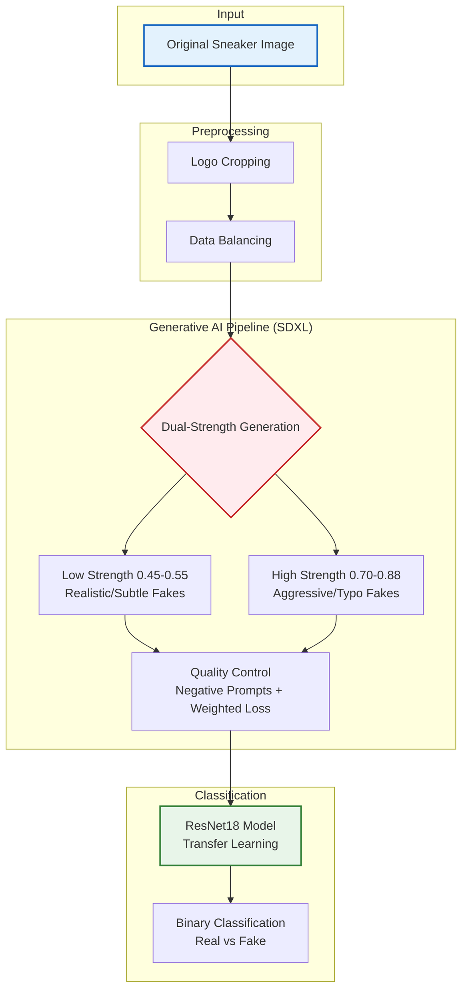

# BrandGuard – GenAI-Based Pipeline for Counterfeit Sneaker Detection 👟🚫

**Automated detection of high-quality and low-quality counterfeit sneaker logos using synthetic data generation and Deep Learning.**

---

## 👥 Team Members
* **Tal Mitzmacher**
* **Amit Mitzmacher**
* **Danny Isserlis**

---

## 1. Project Motivation & Definition 🎯
**The Problem:** The counterfeit market is evolving. Distinguishing between a high-quality fake and an authentic product is becoming increasingly difficult due to a lack of documented fake data.

**Our Goal:** Develop a **Generative Data Pipeline** to create a synthetic dataset of counterfeits and train a classification model (**ResNet18**) to distinguish them with high precision.

**The Innovation:** Instead of relying on scarce real-world fake samples, our system generates variations that alter the logo's semantics (e.g., typos, graphic changes) without compromising its realistic texture.

---

## 2. Visual Abstract (Workflow) 🖼️

The system operates in a closed loop: extracting the authentic logo, generating sophisticated fakes using Stable Diffusion XL (SDXL), and training a classifier on the hybrid dataset.

